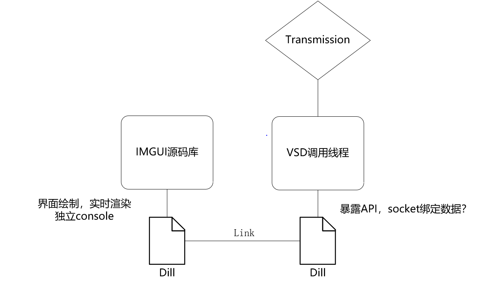

# Dll_IMGUI
参考链接https://www.cnblogs.com/muko-aoi/articles/18659981

code link https://github.com/iconmzy/cmakeDLL_example

# final target

#  build

mkdir build

cd build

cmake ..

cmake --build . --config --release
